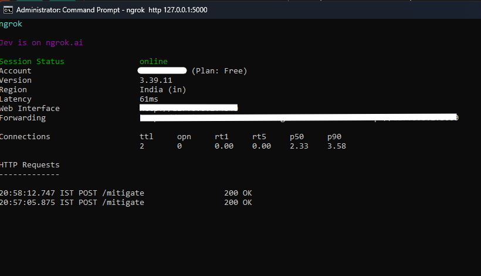
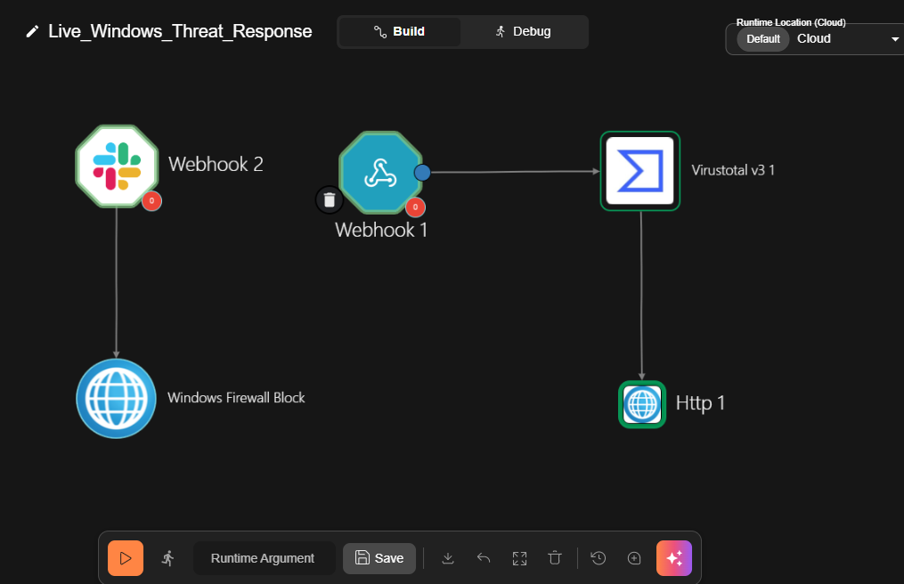
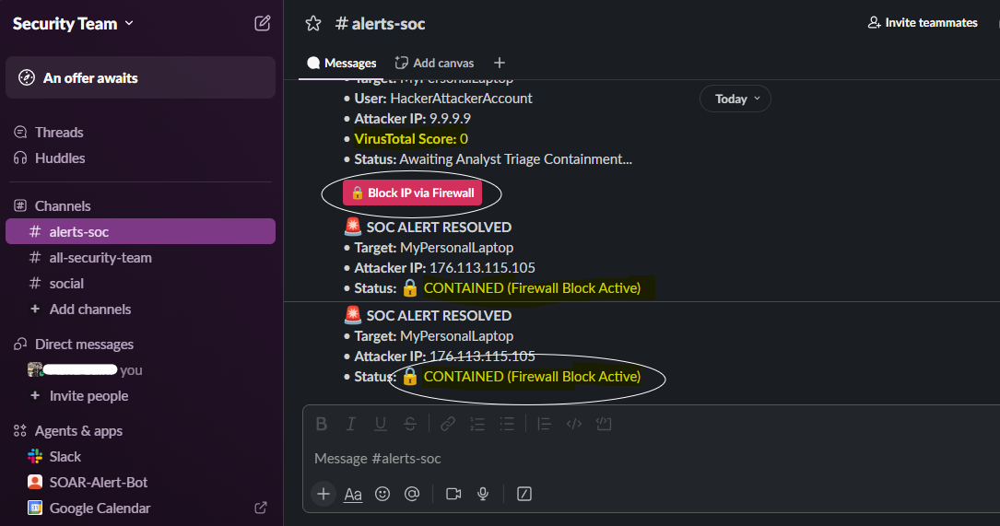
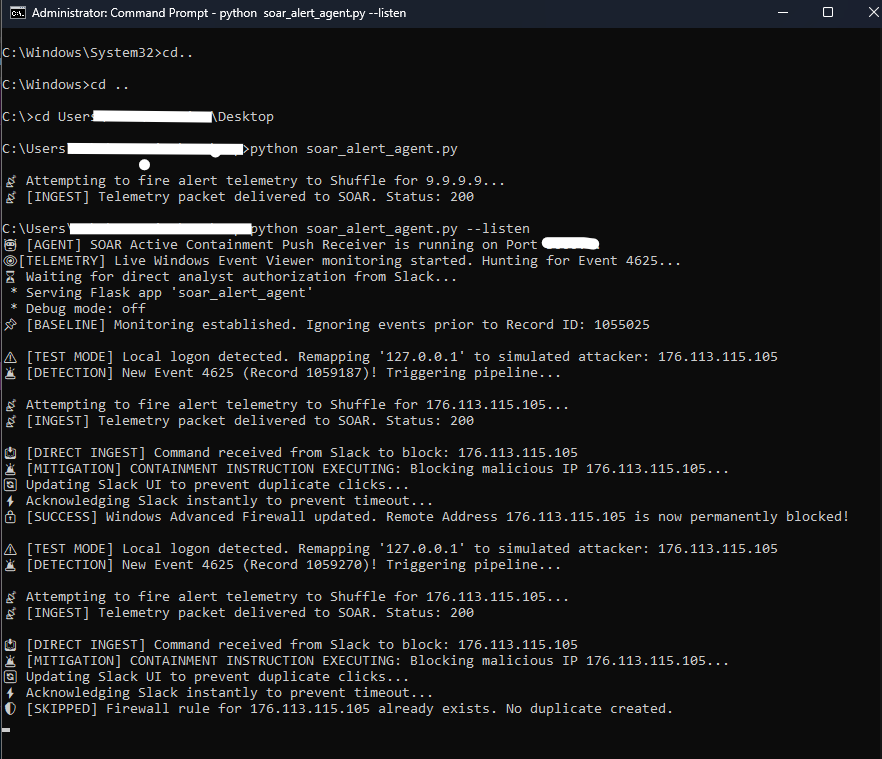

# 🛡️ Project Aegis: Bi-Directional SOAR Containment Pipeline

## Overview
A custom, end-to-end Security Orchestration, Automation, and Response (SOAR) architecture designed for production-grade resilience. This project bridges local host telemetry (Windows Event Viewer) with a cloud-based orchestration engine (Shuffle) and an interactive analyst workspace (Slack) to enable real-time, 1-click threat containment directly from a chat interface. 

Unlike basic webhook projects, this pipeline is engineered to handle API timeouts, URL-encoded payload squashing, state-locking for concurrent analysts, and OS-level idempotency to prevent duplicate firewall rules.

---

## 🏗️ Architecture Flow & Visual Proof

### 1. The Bridge: Reverse Tunneling (Ngrok)
To allow the cloud SOAR platform to communicate securely with a local endpoint without exposing the host to the public internet, a reverse tunnel is established.
* The Ngrok terminal forwards external internet traffic directly to local port 5000[cite: 10].
* The terminal actively listens and logs incoming 200 OK POST requests sent to the local `/mitigate` endpoint[cite: 10].

[cite: 10]

### 2. The Brain: Cloud Orchestration (Shuffle SOAR)
The SOAR canvas acts as the central router for the intelligence and action phases.
* The workflow utilizes a dual-path architecture separated into detection and mitigation[cite: 9].
* **Path 1 (Detection):** Webhook 1 receives the raw IP from the local endpoint, passes it to the VirusTotal v3 node for threat scoring, and forwards the enriched data via HTTP to Slack[cite: 9].
* **Path 2 (Mitigation):** Webhook 2 acts as a dedicated receiver for the Slack button click, routing the payload down to the Windows Firewall Block node[cite: 9].

[cite: 9]

### 3. The Triage: Human-in-the-Loop (Slack UI)
Fully automated blocking carries a high risk of breaking business operations. This pipeline requires human authorization via an interactive Block Kit UI.
* The initial alert card in the `#alerts-soc` channel displays critical context, including the Target, the Attacker IP, and the dynamic VirusTotal Score[cite: 11].
* Analysts are presented with a red "🔒 Block IP via Firewall" button to authorize the containment[cite: 11].
* Upon clicking, the application executes a "State Lock," instantly overwriting the UI card to display "🔒 CONTAINED (Firewall Block Active)" to prevent duplicate actions from other analysts[cite: 11].

[cite: 11]

### 4. The Execution: Live Telemetry & Idempotency (Python Agent)
A background Python daemon acts as both the sensor and the executor on the Windows host.
* **Smart Baselining:** Upon startup, the agent establishes a monitoring baseline (e.g., Record ID 1055025) to ignore historical data and only trigger on new events[cite: 12].
* **Live Hunting:** It continuously polls the Windows Event Viewer for Event 4625 (Failed Logon)[cite: 12].
* **Test Mode Overrides:** If a local logon failure is detected (127.0.0.1), the script safely remaps it to a simulated remote attacker IP (176.113.115.105) for pipeline testing[cite: 12].
* **Idempotent Containment:** When the containment instruction is received from Slack, the script injects a firewall rule and confirms success; if triggered a second time, the PowerShell logic (`$null -eq $rule`) detects the existing rule and skips duplicate creation[cite: 12].

[cite: 12]

---

## ✨ Key Engineering Features

* **Idempotent Firewall Execution:** Employs strict PowerShell validation to ensure the agent safely handles duplicate SOAR triggers without stacking redundant Windows Firewall rules or crashing the OS.
* **Asynchronous Threading:** Bypasses Slack's strict 3-second API timeout window by instantly returning a 200 OK while shifting the heavy OS-level PowerShell execution to a background worker thread.
* **Defensive Payload Parsing:** Automatically detects and decodes messy, URL-encoded JSON strings (`%7B%22...`) generated by native Slack button actions, allowing for clean data extraction locally.
* **Dynamic UI State Locking:** Captures Slack's hidden `response_url` on click to immediately overwrite the original message, preventing race conditions where multiple SOC analysts attempt to block the same IP simultaneously.

## 🚀 Quick Start Instructions

### Prerequisites
* Python 3.8+ (`requests`, `Flask` installed)
* Ngrok (for reverse tunneling)
* A Shuffle SOAR account and a Slack Workspace

### Setup & Testing
1. **Establish the Bridge:** Run `ngrok http 5000` to expose the local receiver.
2. **Configure SOAR:** Update your Shuffle webhook nodes with your newly generated Ngrok URL.
3. **Start the Agent:** Open an Administrator Command Prompt and run the listener.
   ```bash
   python soar_alert_agent.py --listen
